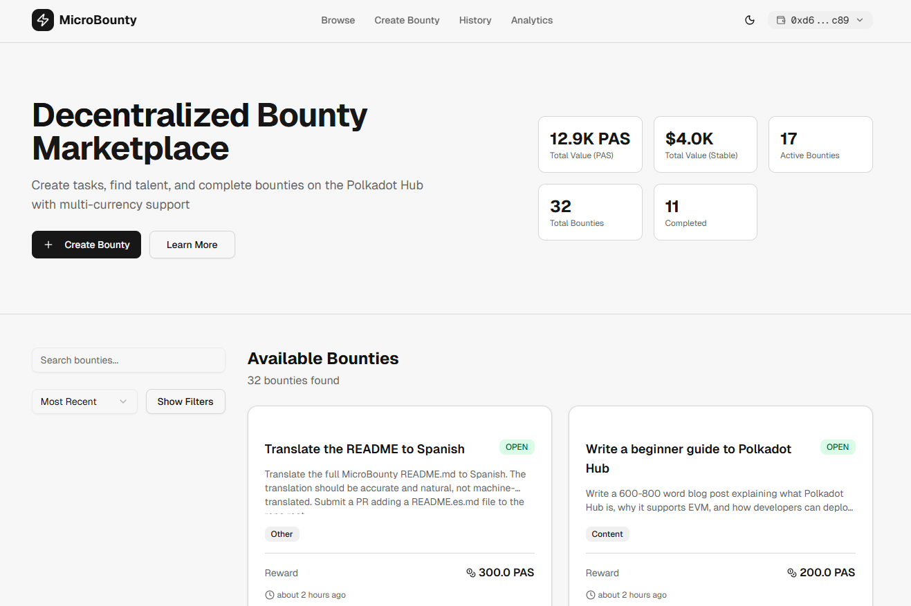

# MicroBounty

> **A decentralized bounty marketplace built natively on Polkadot Hub**

[](https://micro-bounty.vercel.app/)
[](https://blockscout-testnet.polkadot.io/address/0x73fC6177262D64ca26A76ECbab8c1aeD97e84AC5?tab=index)
[](https://dorahacks.io/hackathon/polkadot-solidity-hackathon)
<!-- [](LICENSE) -->



*This project implements Idea #141 (Bounty Payment Platform) using Polkadot Hub's EVM-compatible smart contracts. While the original specification suggested Dedot/PAPI, we chose Solidity to leverage broader developer accessibility while still delivering all core features:* 

- Multi-currency support, 
- Transaction history, 
- Analytics, and 
- Seamless bounty workflows.

## What Is MicroBounty?

MicroBounty is an on-chain bounty platform that lets projects post tasks and pay contributors **instantly and trustlessly** using native **DOT** or stablecoins (**USDC, USDT**) on **Polkadot Hub**.

No middlemen. No escrow disputes. No waiting. Work gets done, payment gets sent.

## The Problem

Polkadot's ecosystem is growing fast, but coordinating small paid work is still painful:

- Projects post bounties in Discord and lose track of them
- Contributors do work with no guarantee of payment  
- Existing bounty tools don't support DOT or Polkadot-native currencies
- Grant processes are too heavy for small tasks

## The Solution

| For Projects | For Contributors |
|---|---|
| Post bounties in DOT or stablecoins | Browse real paid opportunities |
| Funds locked in escrow automatically | Get paid the moment work is approved |
| Approve or cancel with one click | Build an on-chain work history |
| Full analytics dashboard | No upfront networking required |

## How It Works
```
1. CREATE    →   Project posts bounty — funds locked in escrow on-chain
2. SUBMIT    →   Developer submits proof of work (GitHub PR, link, etc.)
3. APPROVE   →   Project approves — payment transfers instantly, trustlessly
```

Status lifecycle: `OPEN → IN_PROGRESS → COMPLETED` (or `CANCELLED` before submission)

## Why Polkadot Hub?

MicroBounty is built **specifically** for Polkadot Hub, not ported from another chain.

### Native DOT Payments (10 Decimals)

DOT has 10 decimal places — not 18 like ETH. Our contract and frontend handle this as a first-class design decision throughout, with no silent precision loss.
```solidity
uint256 public constant MIN_REWARD_DOT = 100e10; // 100 DOT, correct decimals
```
```ts
// Every DOT display and input in the frontend
ethers.formatUnits(amount, 10)
ethers.parseUnits(input, 10)
```

### EVM on Polkadot Hub

We deploy Solidity contracts directly on Polkadot Hub's EVM layer — demonstrating the full Hardhat → Polkadot Hub pipeline end-to-end with real users and live transactions.

### Multi-Wallet Support

Supports MetaMask, SubWallet, Talisman, and any EIP-1193 wallet via Reown AppKit.

### Deployed and Verifiable

[`0x73fC6177262D64ca26A76ECbab8c1aeD97e84AC5`](https://blockscout-testnet.polkadot.io/address/0x73fC6177262D64ca26A76ECbab8c1aeD97e84AC5) on Polkadot Hub Testnet (Chain ID: `420420417`).

## Platform Statistics

> *Testnet — March 2026*

| Metric | Value |
|---|---|
| Total Value Transacted | $12,000+ |
| Paid to Contributors | $1,900+ |
| Bounties Posted | 20+ |
| Completion Rate | 50% |
| Cancellation Rate | 8% |

### Smart Contract (`/contract`)

- Solidity 0.8.28 · Hardhat · Polkadot Hub Testnet
- Multi-currency escrow — native DOT + ERC20 (USDC, USDT)
- OpenZeppelin ReentrancyGuard + SafeERC20
- Checks-Effects-Interactions on all payment functions
- On-chain analytics — platform stats, per-user stats, currency breakdown
- 41 passing tests — full lifecycle coverage

### Frontend (`/frontend`)

- Next.js 15 (App Router) + TypeScript
- Tailwind CSS — responsive, dark/light mode
- Reown AppKit — MetaMask, SubWallet, Talisman
- ethers.js v6 — correct 10-decimal DOT handling throughout
- `BountyContext` — on-chain state, filtering, pagination
- `WalletContext` — PAS + ERC20 balance fetching, wallet name detection

## Quick Start

### Try It Now
1. Visit [micro-bounty.vercel.app](https://micro-bounty.vercel.app/)
2. Connect wallet (MetaMask/SubWallet)
3. Switch to Polkadot Hub Testnet
4. Get testnet DOT from [faucet link]
5. Create your first bounty!

## Demo Video

[](https://www.loom.com/share/fe3baacd28764a30b28a66a7aeadc176)

*5-minute walkthrough of creating, submitting, and approving a bounty*

## Documentation

- **Architecture**: [ARCHITECTURE.md](ARCHITECTURE.md) - Technical design and decisions
- **Smart Contract**: [contract/README.md](contract/README.md) - Contract deployment and testing
- **Frontend**: [frontend/README.md](frontend/README.md) - Frontend setup and development

## Roadmap

**v1.0 — Live ✅**
- Multi-currency bounties (DOT, USDC, USDT)
- Trustless escrow and instant payment
- On-chain analytics and transaction history
- Mobile-responsive UI, dark/light mode

**v2.0 — Planned 🔄**
- XCM integration for cross-chain bounties
- On-chain reputation system
- Milestone-based payments
- Dispute resolution

**v3.0 — Vision 🔭**
- Parachain governance integration
- GitHub issue → bounty automation
- Skills-based contributor matching

## Repository Structure
```
MicroBounty/
├── contract/
│   ├── contracts/MicroBounty.sol
│   ├── contracts/MockERC20.sol
│   ├── test/MicroBounty.test.js
│   ├── scripts/deploy.js
│   ├── scripts/deployMocks.js
│   └── README.md
└── frontend/
    ├── app/
    ├── components/
    ├── context/
    │   ├── BountyContext.tsx
    │   └── WalletContext.tsx
    ├── lib/
    └── README.md
```

## Contributing
```bash
git clone https://github.com/phertyameen/MicroBounty/
```

- Smart Contract: [`contract/README.md`](contract/README.md)
- Frontend: [`frontend/README.md`](frontend/README.md)

## Team

Built by **Fatima Aminu** for the **OpenGuild Hackathon 2025**.

Special thanks to [OpenGuild](https://openguild.wtf) and [Web3 Foundation](https://web3.foundation).

**Contact:** [@teemahbee](https://t.me/teemahbee) · [LinkedIn](https://www.linkedin.com/in/fatima-aminu-839835176/) · [Gmail](aminubabafatima8@gmail.com)

[MIT License](LICENSE) · *MicroBounty — where projects and talent meet on Polkadot.*